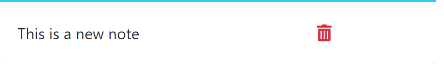

# Note Taker Starter Code

## Table of Content
- [Description](#description)
- [Usage](#usage)

## Description
This application allows for the user to take notes.  It can create a new notes and notes can be deleted.  The data is persisted so the user can just hit the web server at anytime and retrieve his/her's notes.

- Deployment URL - https://note-taker-g78h.onrender.com/notes
- GitHub URL - https://github.com/whougie/note-taker.git

## Usage

Create a new note by typing in a title and a description of the task and click on the "Save Note". 

Clicking on the note on the left side will display the note in the note section.

To delete the the note, you can click on the trash can icon to delete the note.

To clear a form you can click the clear button to clear out the title and text.
